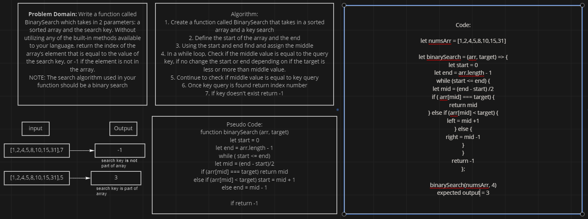

# array-binary-search

## Problem Domain

Write a function called BinarySearch which takes in 2 parameters: a sorted array and the search key. Without utilizing any of the built-in methods available to your language, return the index of the array’s element that is equal to the value of the search key, or -1 if the element is not in the array.
NOTE: The search algorithm used in your function should be a binary search.

## UML

## Approach

I had to do more research on what a binary search was because my first inclination was to do a sequential search because that is what I was used to. The visual from the assignment helped but how it actually worked I was clueless. Upon learning more on what a binary search was it made more sense. A binary search is a more efficient way to look for your target value than a sequential search. The function will define the start and end points to find the middle. If the middle value is equal to the target the index value will be returned. If it is not equal, depending on if the target is higher or lower than the middle, the end or start point will change to find a new middle to validate. This will continue until the value is found. If no value is found then -1 will return. 
