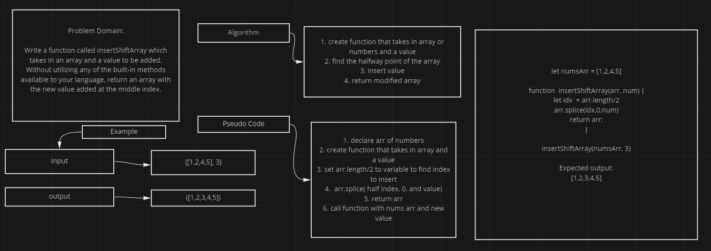

# array-insert-shift

## Problem Domain

Write a function called insertShiftArray which takes in an array and a value to be added. Without utilizing any of the built-in methods available to your language, return an array with the new value added at the middle index.

## UML

## Approach

After looking up the problem and some research I found that using .splice would be efficient. .splice uses up to 3 arguments, the index, how many you want to delete, and the value you want to insert. Then I wanted to find the index of the halfway point so I can give it to splice as a parameter. finally would need to return the now modified array.
