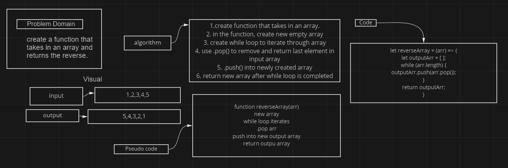

# Reverse and Array

Write a function called reverseArray which takes an array as an argument. Without utilizing any of the built-in methods available to your language, return an array with elements in reversed order.

## Wireframe

## Approach & Efficiency
I knew there was a .reverse() method built in JS but I had to do a little more digging since they ask that we can't use it. Then rememeber other methods like .shift() and .unshift() but as I was reading more about these methods I found .pop() and it seemed to fit better for my purposes. 
