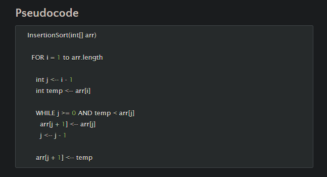

# insertion-sort
## Psuedo Code

## Approach

After reading the provided example, I had a better understanding of the ask. Off the bat I see the that the time efficiency is O(n^2) since there is nest for loop
