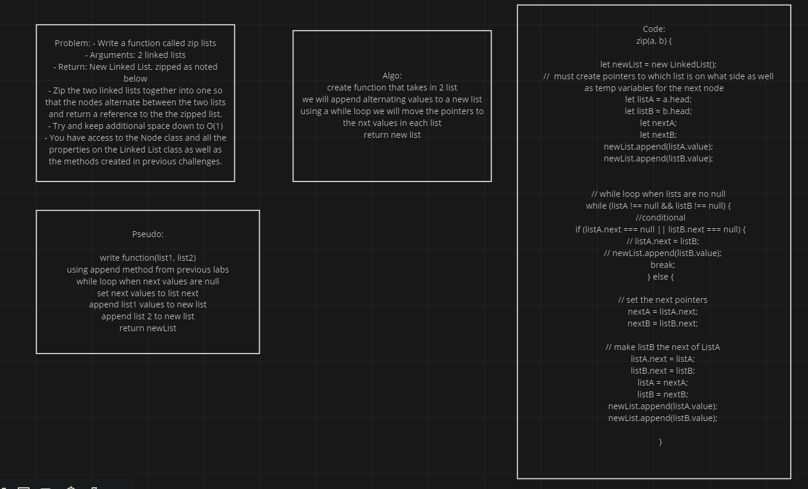

# linked-list-zip

## Problem Domain:

- Write a function called zip lists
- Arguments: 2 linked lists
- Return: New Linked List, zipped as noted below
- Zip the two linked lists together into one so that the nodes alternate between the two lists and return a reference to the the zipped list.
- Try and keep additional space down to O(1)
- You have access to the Node class and all the properties on the Linked List class as well as the methods created in previous challenges.

## UML

## Approach

Is started with how could I do this with out creating a new list where the return will be a modified version of one of the given list. That got a little too hard so I opted create a new list and append (one of the methods we creted previously) the values of the given lists into it. A while loop will iterate through each lists appending them to the new list while moving the pointers while there are still values. 
