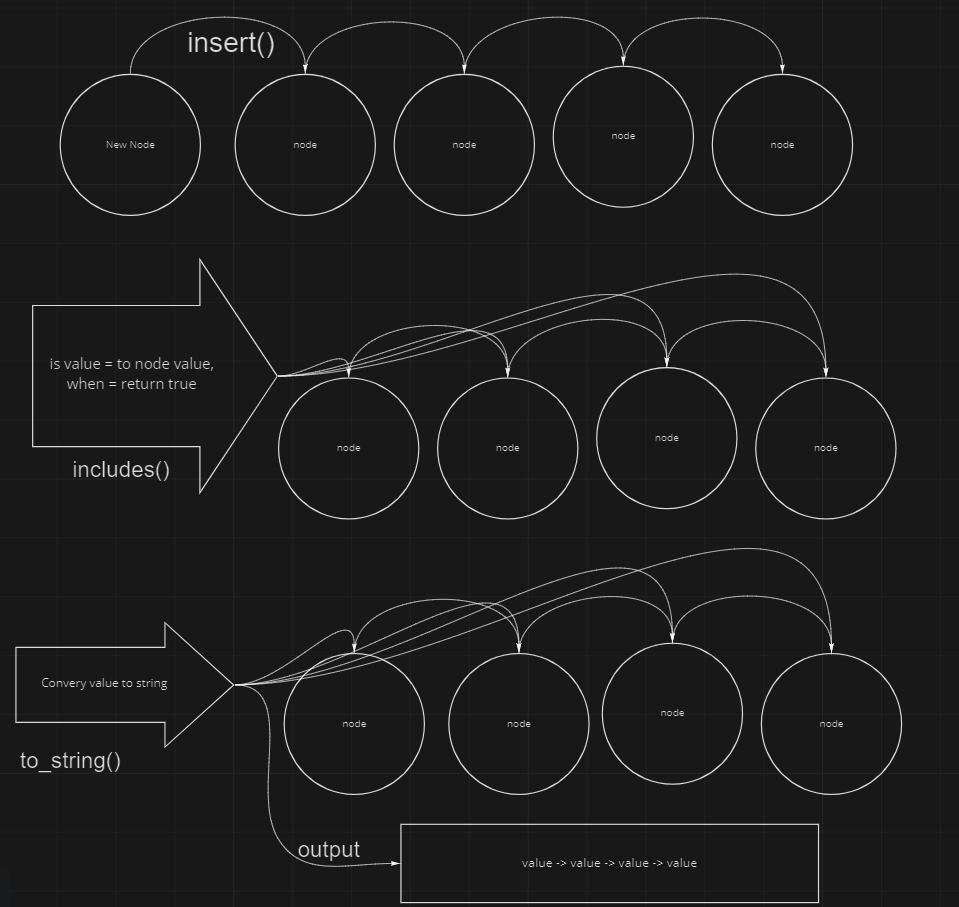

## Singly Linked List

## Problem Domain:

Create a Linked List class

Within your Linked List class, include a head property.

Upon instantiation, an empty Linked List should be created.

The class should contain the following methods

insert()

Arguments: value

Returns: nothing

Adds a new node with that value to the head of the list with an O(1) Time performance.

includes()

Arguments: value

Returns: Boolean

Indicates whether that value exists as a Node’s value somewhere within the list.

to string()

Arguments: none

Returns: a string representing all the values in the Linked List, formatted as:

```  "{ a } -> { b } -> { c } -> NULL" ```

## Approach:

After lecture, I spent some time while I ate my lunch reading about and watching videos on linked list. I had a better understanding of them after my lunch concluded and dove right it. My approach was to use my found recourses and apply it to each method.

## UML


