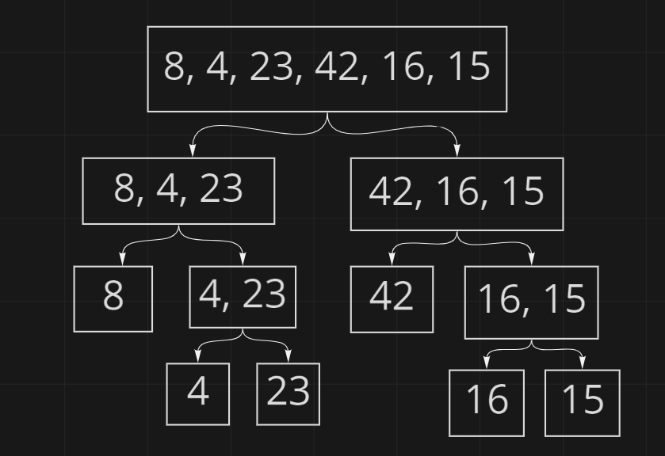
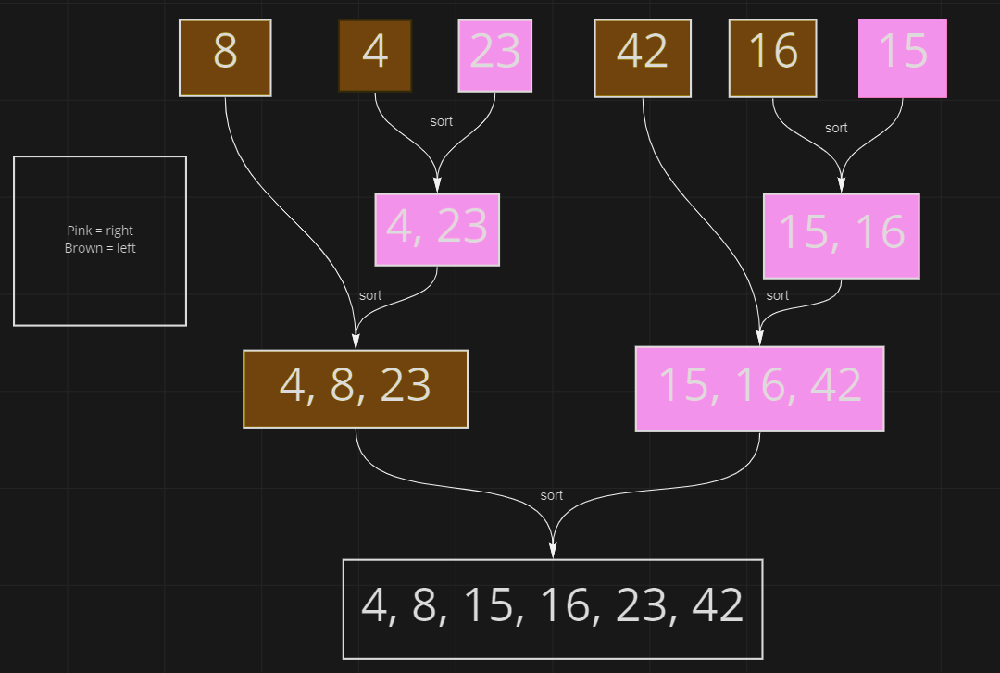

# merge-sort

## pseudo code

    ALGORITHM Mergesort(arr)
    DECLARE n <-- arr.length

    if n > 1
      DECLARE mid <-- n/2
      DECLARE left <-- arr[0...mid]
      DECLARE right <-- arr[mid...n]
      // sort the left side
      Mergesort(left)
      // sort the right side
      Mergesort(right)
      // merge the sorted left and right sides together
      Merge(left, right, arr)

    ALGORITHM Merge(left, right, arr)
    DECLARE i <-- 0
    DECLARE j <-- 0
    DECLARE k <-- 0

    while i < left.length && j < right.length
        if left[i] <= right[j]
            arr[k] <-- left[i]
            i <-- i + 1
        else
            arr[k] <-- right[j]
            j <-- j + 1

        k <-- k + 1

    if i = left.length
       set remaining entries in arr to remaining values in right
    else
       set remaining entries in arr to remaining values in left

## Process

This pseudo code comes in 2 parts: The main merge sort and then a merge

Given an array of numbers the mergeSort() function will split the length of the array in half with it rounding down in the case of an odd length in the array. The mergeSort() function is then called recursively for the now split left and right sides ready to be compared for sorting

Next we will now sort the array form least to greater using the helper function merge() with the parameters 'left' 'right' and 'arr' passed in it. While there is something in the the left and right arrays, the compare will if statements will trigger and place the smallest number in first in the original array. this process will continue until the left and right arrays are empty. Once complete the result will return the now modified array

## Big O

Time: O(nlog(n))
Space: O(n) ~ I think

## Resources

[Merge sort in 3 minutes](https://www.youtube.com/watch?v=4VqmGXwpLqc)
