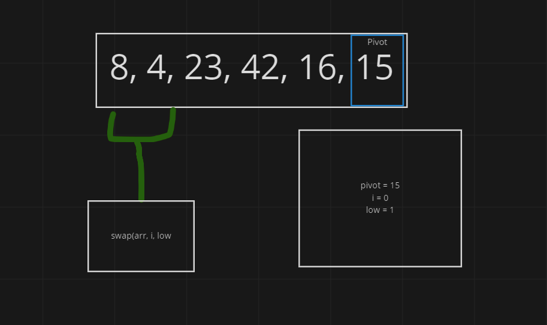

# quick-sort

## pseudo code
    ALGORITHM QuickSort(arr, left, right)
      if left < right
        // Partition the array by setting the position of the pivot value
        DEFINE position <-- Partition(arr, left, right)
        // Sort the left
        QuickSort(arr, left, position - 1)
        // Sort the right
        QuickSort(arr, position + 1, right)

    ALGORITHM Partition(arr, left, right)
      // set a pivot value as a point of reference
      DEFINE pivot <-- arr[right]
      // create a variable to track the largest index of numbers lower than the defined pivot
      DEFINE low <-- left - 1
      for i <- left to right do
        if arr[i] <= pivot
          low++
          Swap(arr, i, low)

     // place the value of the pivot location in the middle.
     // all numbers smaller than the pivot are on the left, larger on the right.
     Swap(arr, right, low + 1)
    // return the pivot index point
     return low + 1

    ALGORITHM Swap(arr, i, low)
      DEFINE temp;
      temp <-- arr[i]
      arr[i] <-- arr[low]
      arr[low] <-- temp

## Process

Quick sort is comprised of 3 helper functions: _quickSort() where the recursive behavior starts by defining a position or a pivot point. The position is defined by the second function called partition() where we compare values in the array with the pivot point and if they needed to be swapped based if the value is lower or higher than the pivot. The third function is swap() where if the partition function finds values to swap, that function will be called.

In my quickSort.js file there is the addition of called quickSort that takes in an array and inside there will be the initial values that are needed to start the main _quickSort function.

## Resources 

[Quick Sort in 4 minutes](https://www.youtube.com/watch?v=Hoixgm4-P4M)
[Geeks for Geeks - Quick Sort](https://www.geeksforgeeks.org/quick-sort/)
