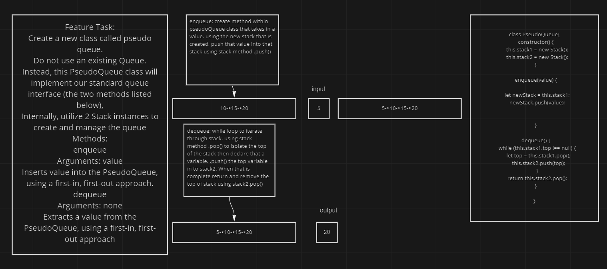

# stack-queue-pseudo

## Feature

- Create a new class called pseudo queue.
- Do not use an existing Queue.
- Instead, this PseudoQueue class will implement our standard queue interface (the two methods listed below),
* Internally, utilize 2 Stack instances to create and manage the queue

- Methods:
  - enqueue
    Arguments: value
    Inserts value into the PseudoQueue, using a first-in, first-out approach.
  -  dequeue
    Arguments: none
    Extracts a value from the PseudoQueue, using a first-in, first-out approach

NOTE: The Stack instances have only push, pop, and peek methods. You should use your own Stack implementation. Instantiate these Stack objects in your PseudoQueue constructor.

## Approach
This one was difficult because the ask was a little confusing. After asking Jacob we, Michael Metcalf and I,  got some clarity. Using 2 stacks that are built into the class as constructors, create 2 methods. Using the built in methods inside the stack class we wre able to name those values in to the stack that lives inside the pseudo queue class. To dequeue, I will need to utilize a second stack to reverse the order and then pop the values of the new stack as the return. 

## UML

